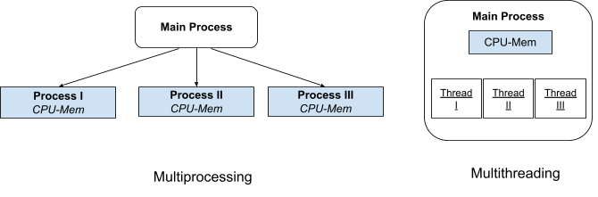

Most modern CPUs have multiple cores, which enable parallel computing in Python. Parallel computing involves performing multiple tasks simultaneously to reduce the overall runtime of a program. In Python, a process is an instance of a program created by the operating system, with its own dedicated memory space. A thread, on the other hand, is a smaller unit of execution within a process. Each process can contain multiple threads, and these threads share the same memory space within the process. Because of this shared memory, if one thread modifies a variable, the change is visible to all other threads in that process. In contrast, separate processes do not share memory—modifying a variable in one process does not affect variables in another process. While threads within a process share memory, they maintain separate stack traces and CPU registers. Multithreading allows multiple threads to run concurrently within a single process, enabling simultaneous execution of smaller tasks. This is one of the ways to achieve parallelism, particularly when tasks are I/O-bound or when you want to optimize resource sharing within a program. The following figure shows difference between multithread proceess, and multiprocessing 

<figure markdown="span">
  { width="800" }
  <figcaption>Multi Threaded & MultiProcessing Env.</figcaption>
</figure>

Python has a feature called the Global Interpreter Lock (GIL), which allows only one native thread to execute Python bytecode at a time. As a result, it prevents multiple threads from running Python code simultaneously within the same process. This limitation exists because Python was originally designed before multi-core processors became common in personal computers.

In this section, we review the concepts of multiprocessing and multithreading, which are key to achieving parallelism and concurrency in Python:

* [Multiprocessing](ch10_multiprocessing.md) An overview of the multiprocessing module, which enables parallel execution using separate processes that bypass the GIL.
* [Joblib](ch10_joblib.md) A review of Joblib, a high-level library that simplifies parallel computing, particularly for tasks involving loops and data processing. 
* [Multithreading](ch10_threading.md) A discussion of the threading module and how multithreading can be used for I/O-bound tasks, despite the GIL.
